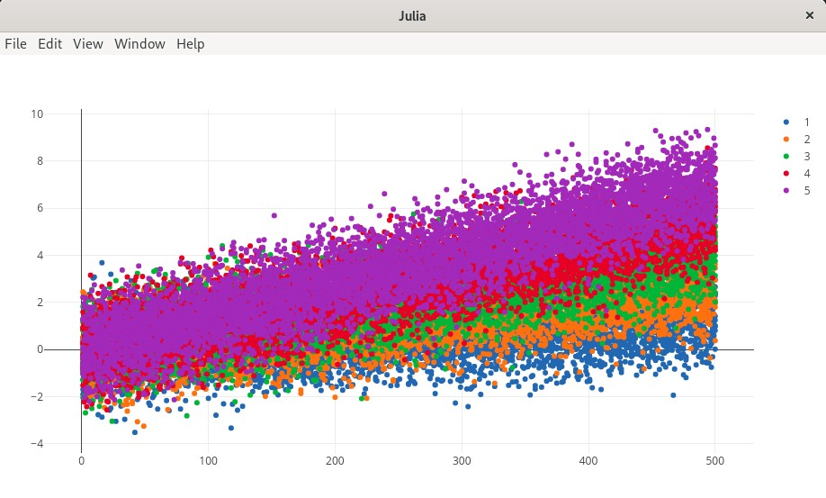

# FeatureScreeningDemo.jl
> Utility functions (e.g. plotting input data)

## Setup
Install Julia v >= 1.6.0.
Start Julia, and install the package:
```
$ julia
julia>     -- Press ]
(@v1.6) pkg> add FeatureScreeningDemo     -- TODO set correct path
(@v1.6) pkg>       -- Press Backspace
```
Don't exit, stay in Julia.

## Usage
Start Julia:
```
$ julia
```

Create a random feature dataset:
```
julia> using FeatureScreening

julia> feature_set = rand(FeatureSet, 25, 200; label_count = 5)
FeatureSet{Int64, Int64, Float64}<25 x 200>
```
### Plotting

```
julia> using PlotlyJS

julia> using FeatureScreeningDemo

julia> plot(feature_set)
```


